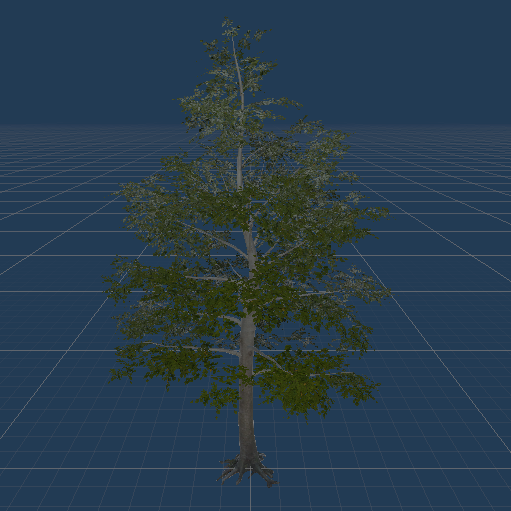
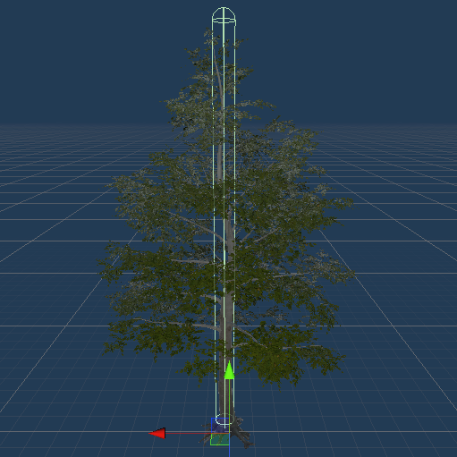
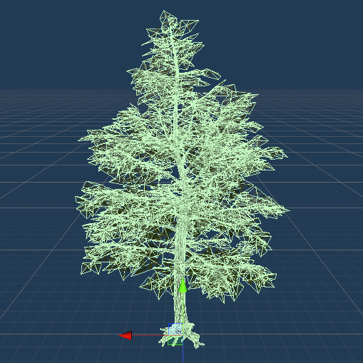
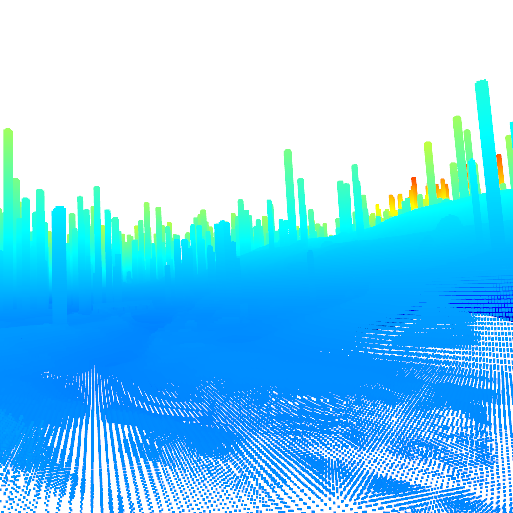
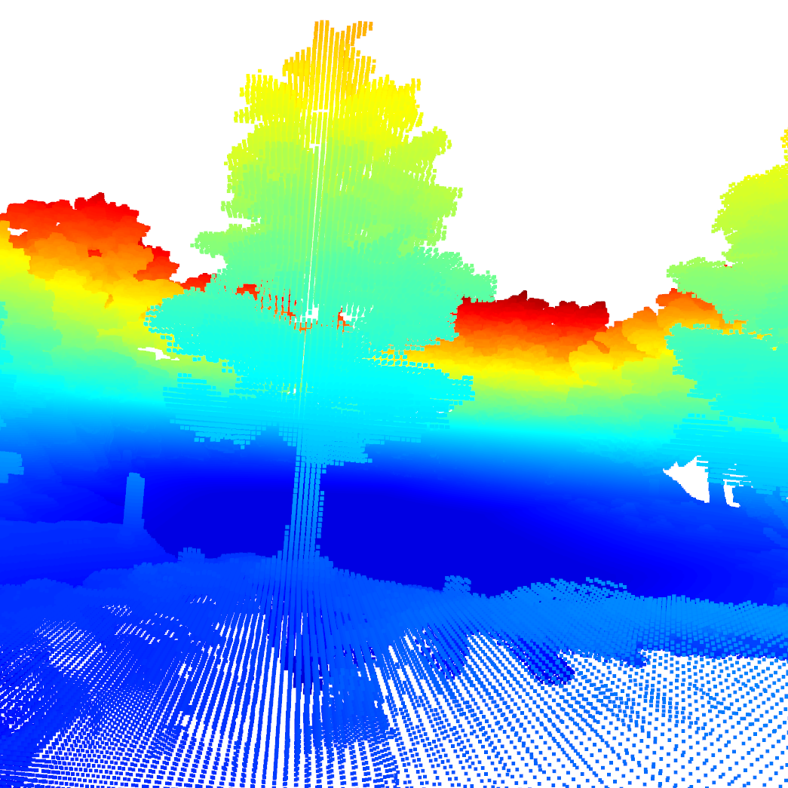

.. _detailed-colliders:

Detailed Colliders
==================

To create realistic point clouds and collision detection the colliders need to be as detailed as possible.
If performance is more important then environments with mainly primitive colliders and no mesh colliders are recommended.

`Here <https://docs.unity3d.com/2020.1/Documentation/Manual/CollidersOverview.html>`_ more information about all types of colliders in Unity3D.

Mesh Colliders
--------------

The Mesh Collider takes a Mesh Asset and builds its Collider based on that Mesh.
It is more accurate for collision detection than using primitives for complicated Meshes. 

More details can be found `here in the Mesh Collider manual <https://docs.unity3d.com/2020.1/Documentation/Manual/class-MeshCollider.html>`_.

..warning:: There are some limitations to Mesh Colliders.

Terrain Trees
-------------

The `Terrain Trees <https://docs.unity3d.com/Manual/terrain-Trees.html>`_ are a feature in Unity that let you draw trees on a terrain.
The disadvantage is that it does not allow you to have Mesh Colliders.
This has performance advantages though does not allow accurate collisions and point clouds.
In the following three figures you can see the tree prefab, the primitive capsule collider that Unity adds and in the last image the Mesh Collider of the Tree.

|mesh1| |mesh2| |mesh3|

Painting trees with the Unity terrain tool is efficient and Asset Store environments might have used it.
Therefore our solution to this problem involved adding a script, called the `terrainTreeManager.cs <https://github.com/uzh-rpg/rpg_flightmare_unity/blob/dev/flightmare-release/Assets/Flightmare/Flightmare/Scripts/HelperScripts/terrainTreeManager.cs>`_, to these environments.
It extracts all trees on the terrain and replaces them with the prefab which has an active mesh collider on every scene load.

The difference in the point cloud is visible here.

|pc1| |pc2|

